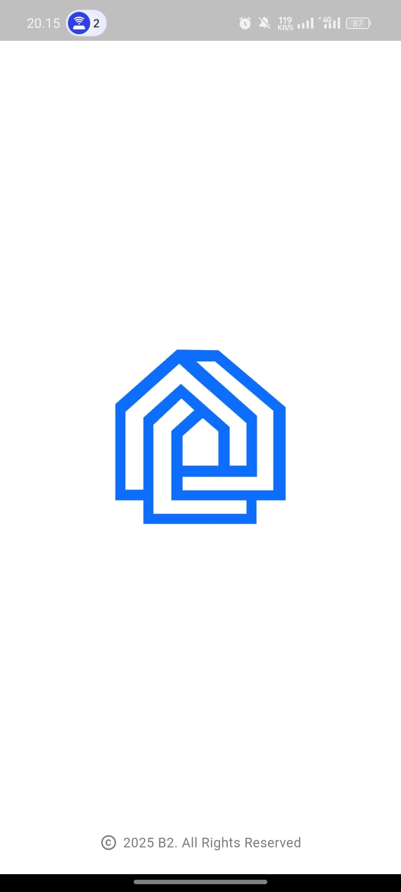
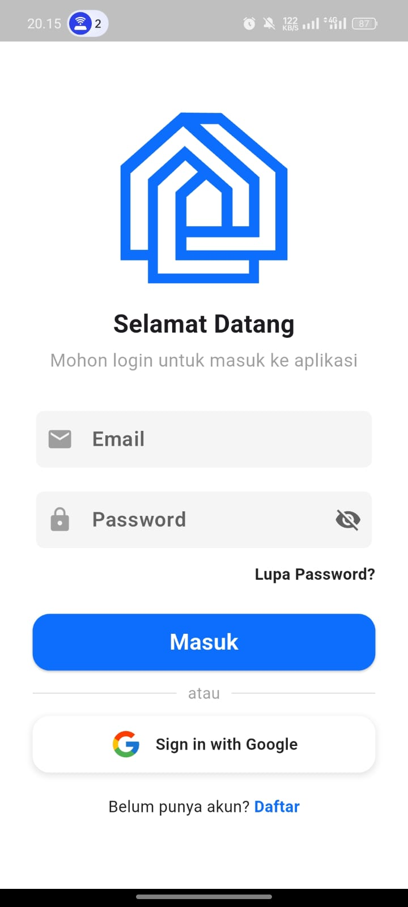
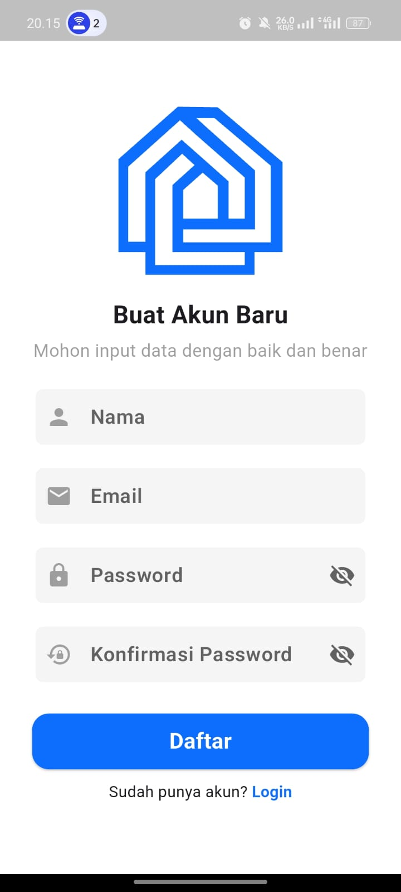
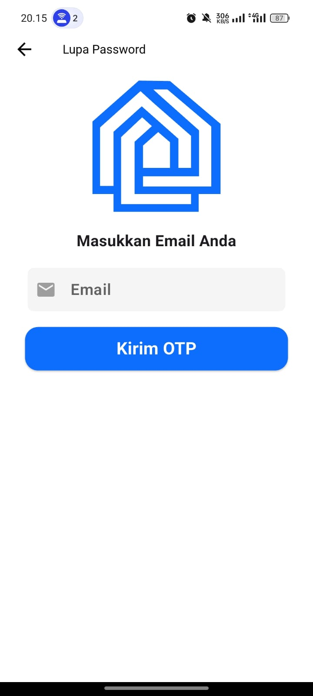
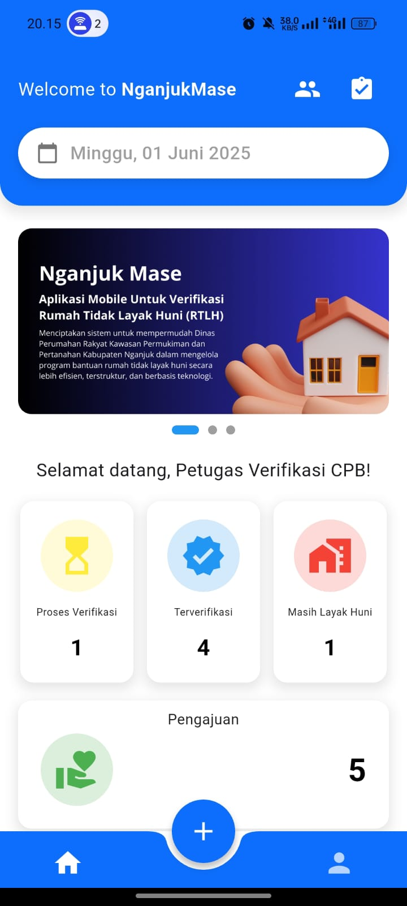
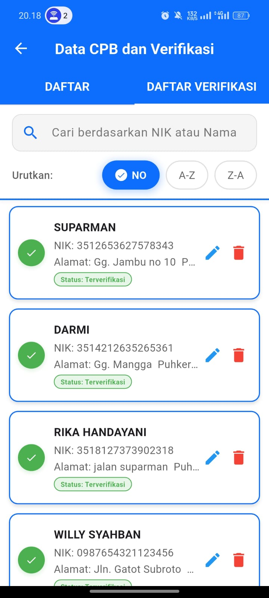
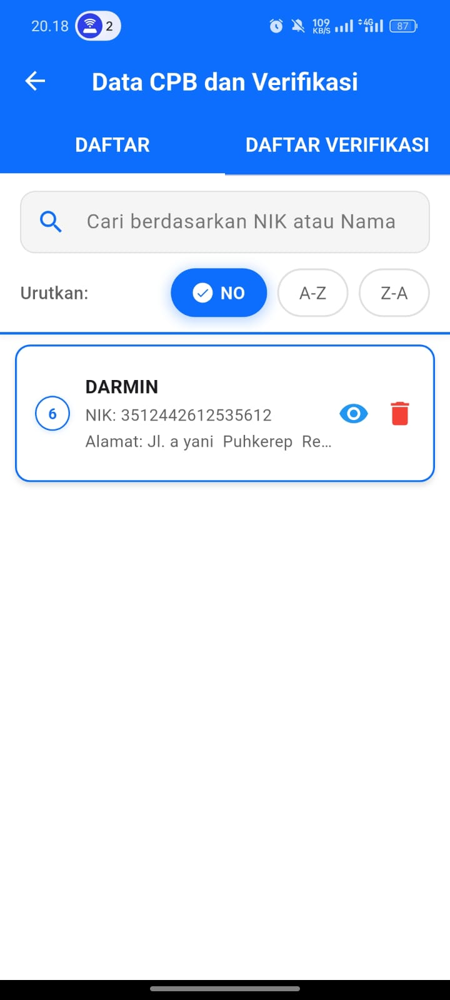
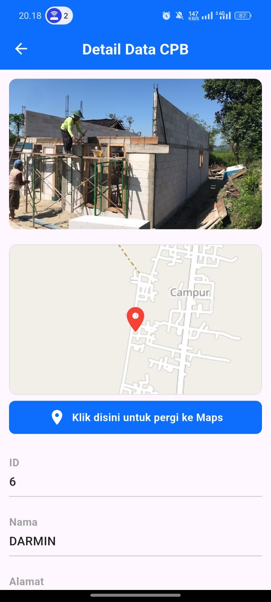
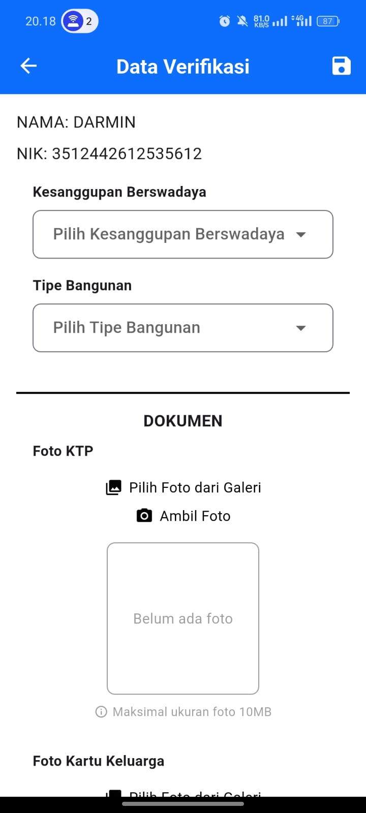

# 📱 NganjukMase Mobile – Aplikasi Verifikasi Data CPB

**NganjukMase Mobile** adalah aplikasi mobile yang digunakan oleh **Petugas Verifikasi Data CPB** untuk melakukan proses survey dan verifikasi calon penerima bantuan rumah tidak layak huni (RTLH) di Kabupaten Nganjuk. Aplikasi ini merupakan bagian dari sistem terintegrasi dengan website **NganjukMase** yang dibangun menggunakan Laravel.

## 🧩 Teknologi yang Digunakan

- **Flutter & Dart** – Framework dan bahasa pemrograman utama untuk pengembangan aplikasi mobile cross-platform.
- **Firebase Authentication** – Untuk manajemen login menggunakan Google Account.
- **RESTful API** – Berkomunikasi dengan backend Laravel untuk mengambil dan mengirim data.
- **Chart Libraries (misal: fl_chart)** – Untuk menampilkan grafik statistik CPB.
- **Provider / Bloc** – Untuk state management (sesuaikan sesuai arsitektur yang dipakai).

## 🎯 Fitur Utama Aplikasi

### 🔐 Autentikasi

- Login dengan Google menggunakan Firebase Auth
- Login dengan email dan password
- Register akun petugas
- Lupa password via OTP melalui gmail

### 👤 Profil Pengguna

- Menampilkan informasi profil petugas
- Edit profil (jika diperlukan)

### 📊 Home Screen

- Menampilkan:
  - Jumlah total data CPB
  - Jumlah data CPB yang sudah diverifikasi
  - Jumlah CPB yang lolos dan tidak lolos seleksi
  - Grafik statistik CPB

### ✅ Verifikasi Data CPB (Fitur Utama)

- Petugas dapat memilih data CPB dari daftar
- Input hasil survei lapangan secara manual
- Sistem akan menghitung otomatis apakah CPB **layak atau tidak layak** menerima bantuan
- Hasil verifikasi tersimpan dan dikirim ke server via API

## 📷 Tampilan Aplikasi

Berikut adalah beberapa tampilan antarmuka dari aplikasi NganjukMase Mobile:

  

    
    
<em>Splash Screen</em>

  

  

    
    
<em>Login Screen</em>

  

  

    
    
<em>Register Screen</em>

  

  

    
    
<em>Lupa Password Screen</em>

  

  

    
    
<em>Home Screen</em>

  

  

    
    
<em>Verifikasi Data CPB</em>

  

  

    
    
<em>Data CPB</em>

  

  

    
    
<em>Detail Data CPB</em>

  

  

    
    
<em>Proses Verifikasi Data CPB</em>

  

  

    
    
<em>Profil Pengguna</em>

  

## 📥 Cara Menjalankan Proyek (untuk Developer)

### Prasyarat

Pastikan Anda sudah menginstal:

-  – Framework Flutter
-  – Bahasa pemrograman utama Flutter
-  – IDE pilihan Anda
-  – Untuk setup autentikasi Google
